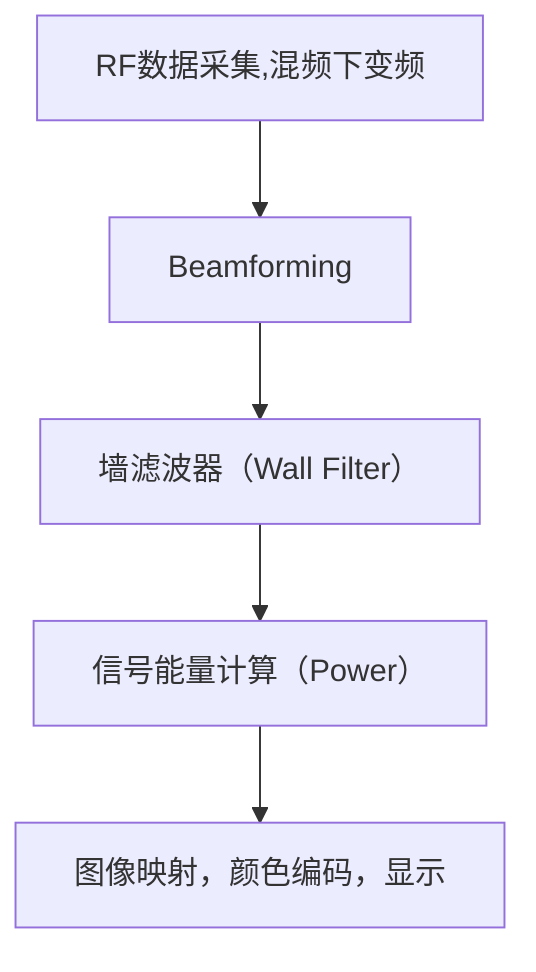

# Medical Ultrasound - Power Doppler (PD)

## 一、历史背景简述

多普勒超声技术最早由Shigeo Satomura[日本]在1950年代引入医学，用于检测心脏血流。随后发展出彩色多普勒（Color Doppler）和功率多普勒（Power Doppler, PD）等多种形式。PD 于1990年代初被提出，是彩色多普勒的一种改进形式，专注于血流信号强度的可视化。

- **1950s**: 日本学者里村茂夫(Shigeo Satomura)首次将多普勒效应应用于生物医学检测，开发出连续波多普勒系统用于外周血管研究
- **1959**: Satomura发表首篇多普勒超声心动图论文，开创血流动力学无创评估先河
- **1980s**: 彩色多普勒(Color Doppler)技术实现商业化，由Aloka公司率先推出
- **1994**: Rubin等人在《Radiology》正式提出Power Doppler概念 **(原称Color Doppler Energy)**
- **1995**: 西门子推出首台集成Power Doppler的临床设备（Acuson 128XP/10）

| 时期         | 技术突破                  | 局限性解决             |
|--------------|--------------------------|--------------------------|
| 1950s        | 连续波多普勒              | 只能检测高速血流         |
| 1982         | 脉冲波多普勒              | 实现深度分辨但易混叠     |
| 1985         | 彩色多普勒                | 角度依赖/低速血流不敏感  |
| **1994**     | 功率多普勒 **(PD)**       | 解决上述所有问题         |

---

## 二、动机与特点（为什么使用 Power Doppler）

- **低速度区表现更佳：** 相较彩色多普勒对高速流更敏感，PD 对低速微血流更可靠，特别适用于小血管和低速血流检测（如甲状腺、肿瘤新生血管等）。
- **角度无关性：** 不依赖声束与血流方向之间的夹角。

---

## 三、原理解析（重点）

Power Doppler 图像核心是通过对 slow-time 序列进行统计，估算每个像素点的**血流散射能量**，而非其速度或频率。

### 流程图：

### 1. 信号采集与前处理： 
   - 超声探头发出超声波，遇到血液中的**红细胞**被散射，接收到**射频（RF）信号**。
   - 对同一位置进行多次重复采样，形成 slow-time 时间序列：

     

     
     

   
   - IQ 解调 (Demodulation)
   - 波束合成 (Beamforming)
     得到信号维度为 $(x, y, n)$，其中 $n = [1, \dots, N]$ 是 slow-time 维度

     
### 2. 墙滤波 (Wall Filter)：
   使用高通滤波器去除低频的组织运动干扰（如心跳、呼吸运动），保留真正由血流引起的频率分量。

| 分量       | 频率特性        | 振幅强度        |
| -------- | ----------- | ----------- |
| **组织运动** | 低频（0-30 Hz） | **强，但缓慢变化** |
| **血流信号** | 高频（>50 Hz）  | 弱，但快速波动     |

**🎯 目标：**
* **抑制组织分量（低频、低变化）**
* **保留血流分量（高频、快速波动）**

#### 🚧 常用方法：

| 方法    | 去组织效果  | 保血流能力 | 计算量   | 实时性 |
| ----- | ------ | ----- | ----- | --- |
| FIR高通 | 中      | 中     | 低     | 高   |
| Poly  | 中高     | 高     | 中     | 中   |
| DCT   | 高      | 中高    | 中     | 中   |
| SVD   | **最高** | **高** | **高** | 低   |

* SVD 是目前研究最活跃的方法之一，但计算负担大。
* 临床设备多数采用优化过的 FIR 高通滤波或 Poly 滤波。
  
1. **高通滤波器（经典 Wall Filter）**

   * 本质是沿 slow-time 维度施加时间序列的高通滤波器。
   * 可为 FIR/IIR 滤波器，或移动平均差分型滤波器。

2. **正交多项式回归法（Poly）**

   * 使用 Legendre 多项式对 slow-time 曲线建模，去除低阶成分（即“平滑”趋势），留下高频分量。
     
     Least-squares ($\lambda^\textrm{th}$ degree) polynomial regression - Orthogonal Legendre polynomials are used. The fitting polynomial is removed from the original I/Q or RF data to keep the high-frequency components. $\lambda$, with $\lambda \geq 0$, represents the degree of the polynomials. The (slow-time) mean values are removed if $\lambda = 0$ (the polynomials are reduced to constants).
  
3. **离散余弦变换（DCT）**

   * DCT 在 slow-time 上将信号分解为频率成分，去除前 n 项（低频组织分量），再反变换。
     
     Truncated discrete cosine transform - Discrete cosine transforms (DCT) and inverse DCT are performed along the slow-time dimension. The signals are filtered by withdrawing the first $\lambda (\geq = 1)$ components, i.e. those corresponding to the $\lambda$ lowest frequencies (with respect to slow-time).
     
4. **奇异值分解（SVD）**

   * 将 slow-time 信号矩阵按帧堆叠成二维矩阵。
   * 组织分量通常主导前几个奇异向量，对应最大奇异值。
   * 保留后面的小奇异分量以提取血流信号。
     
     Truncated singular value decomposition - An SVD is carried out after a column arrangement of the slow-time dimension. The signals are filtered by withdrawing the top $\lambda$ singular vectors, i.e. those corresponding to the $\lambda$ greatest singular values.

 

### 3. **信号能量计算（Power Calculation）**
将每个像素位置 $(x, y)$ 处的 slow-time 信号组合成一组，称为一个 ensemble, $[s_1, s_2, s_3, ..., s_N]$, 用于计算统计特征（功率、方差等）

#### ✅ 方法一：时域能量估计（常用）

* 直接对 IQ 信号模值平方后求和：

$$
P(x, y) = \sum_{n=1}^{N} |s_n(x, y)|^2 
$$

* **优点：** 简单、高效、适合实时成像。
* **解释：** 越多血细胞通过，对应信号越强，功率越大 → 图像越亮。

#### ✅ 方法二：频域功率谱分析（可选）

* 对每组 ensemble 执行快速傅里叶变换 (FFT)，得到频谱：

$$
S(f; x, y) = \text{FFT}[s_n(x, y)]
$$

* 取模平方，在频域积分：

$$
P(x, y) = \int |S(f; x, y)|^2 df
$$

* **优点：** 适合后处理或研究级应用，能分离噪声频段。
* **缺点：** 实时计算负担较重。

#### 📌 对比总结：

| 方法  | 速度 | 实时性 | 精度 | 应用场景     |
| --- | -- | --- | -- | -------- |
| 时域法 | **高**  | **优**   | 中  | 临床实时成像   |
| 频域法 | 中低 | 差   | **高**  | 研究/复杂分析用 |

---
